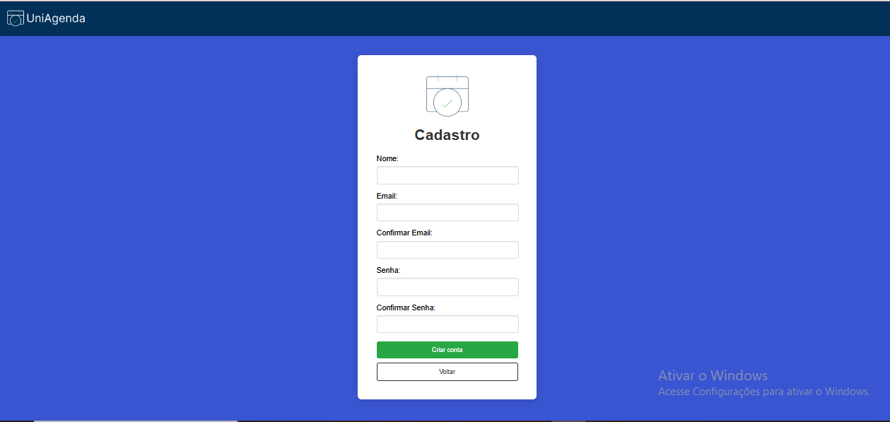
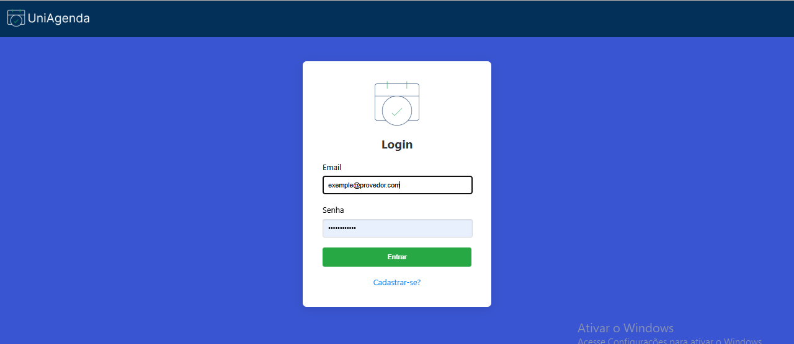
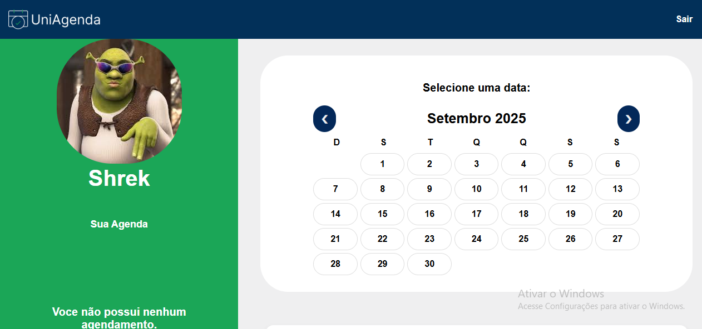

# 📅 Agenda de Salas – Universidade

Este é um sistema desenvolvido para auxiliar professores da minha universidade na **organização de salas de aula**.  
A plataforma permite **cadastro, login e agendamento de salas**, facilitando a gestão do espaço físico da instituição.  

> ⚠️ O código-fonte não está disponível neste repositório.  
> O objetivo é apenas demonstrar as telas e funcionalidades do projeto.

---

## ✨ Funcionalidades
- 👤 **Cadastro e Login** de professores.  
- 🗓️ **Visualização da agenda** com perfil do usuário e calendário.  
- 📍 **Sistema de agendamento** ao selecionar uma data específica.  
- 📝 **Registro de reservas** exibido abaixo da foto de perfil.  

---

## 🖼️ Telas do Sistema

### 🔑 Tela de Cadastro

### 🔒 Tela de Login

### 🏠 Tela Inicial – Perfil + Agenda

### 📆 Tela Inicial – Sistema de Agendamento

### 📝 Tela Inicial – Registro de Cadastro

---

## 📚 Sobre o Projeto
- Desenvolvido para uso acadêmico, voltado à organização de professores.  
- Focado em **usabilidade simples e rápida**.  
- Estruturado para funcionar como uma ferramenta interna da universidade.  

---

## 📄 Licença
Este repositório é apenas de **demonstração**.  
As imagens e descrições são de uso exclusivo do autor.  

